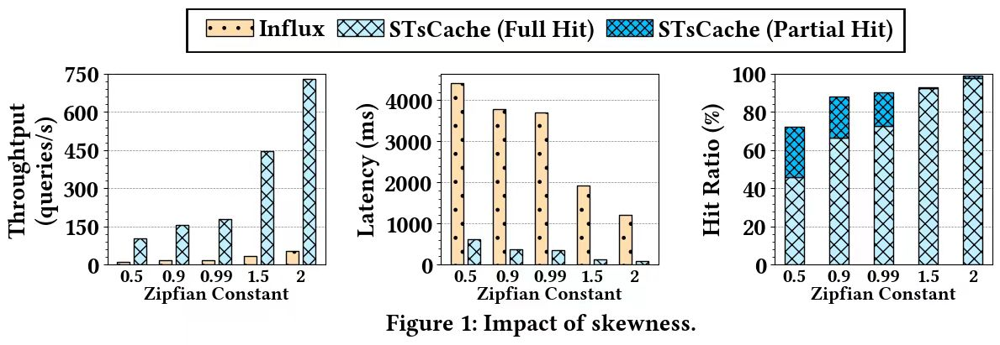

# Experiment  

## Impact of Skewness

In our experiments, the Zipfian Constant was set to 0.99, which is the default value. To explore the  system performance under different skewness of the workload, we conducted experiments with  Zipfian Constants set to 0.5, 0.9, 0.99, 1.5, and 2. Figure 1 illustrates the impact of workload  skewness on system performance. The performance of InfluxDB and STsCache improves with the  increase of workload skewness, particularly STsCache. In highly skewed workloads, STsCache  optimizes query efficiency by retaining hot data to quickly respond to new queries.